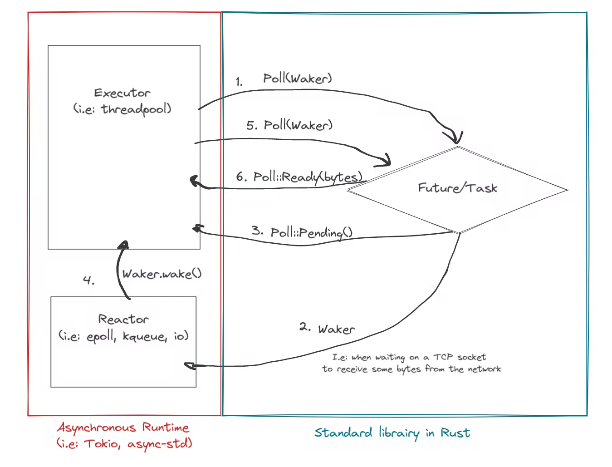

# rust-patterns
This is a repo where I try different design patterns and language specific quirks in rust.

## State

Pros
- State changes/logic remain associated with state trait which can have default implementation to reduce code .
- Easy to extend with new states.

Cons
- Code repetition as we try to perform the same operation while chanding from one state to another (which can be reduced using macros).
- State coupling, when we try to add a state between two adjacent states.
- Invalid state transitions or access are not caught at compile time.

Fixes
- Having different structs and implementations for each state of License process in this example so that we get compile time error trying to set and get invalid states.

## State Encoding into type system

Pros
- The compile time type check prevents unwanted methods from being exposed and throwing errors unlike state pattern.
- More decoupled than State patten as less code needs to be changed if an intermediary need to be introduced.

Cons
- Code repetition as we try to perform the same operation while chanding from one state to another (which can be reduced using macros).

## Sidecar Pattern

Sidecar Pattern is a system design pattern used in microservices that involves using a separate container or process to provide additional functionality to a primary application. The sidecar runs alongside the primary container and communicates with it through a shared network interface or file system, allowing it to provide services such as logging and observability.

Pros
- Allows additional functionality to be added without modifying the code of the primary container,
- Can provide better isolation and security for the primary container, as it can be run with different permissions.
- Modularity and scalability

## Folder Structure

|  |  |  |  |  |
| ------ | ------ | ------ | ------ | ------ |
| \src  |   |
|   | \playbook  | Testing Rust's language specific magic |
|   |  | simd.rs | SIMD vendor specific optimizations for vector processing vs auto-vectorization |
|   |  | strtok.rs | In place string manipulation, why it breaks rust and workarounds  |

## Images

Async Workflow

<picture>
  
</picture>
